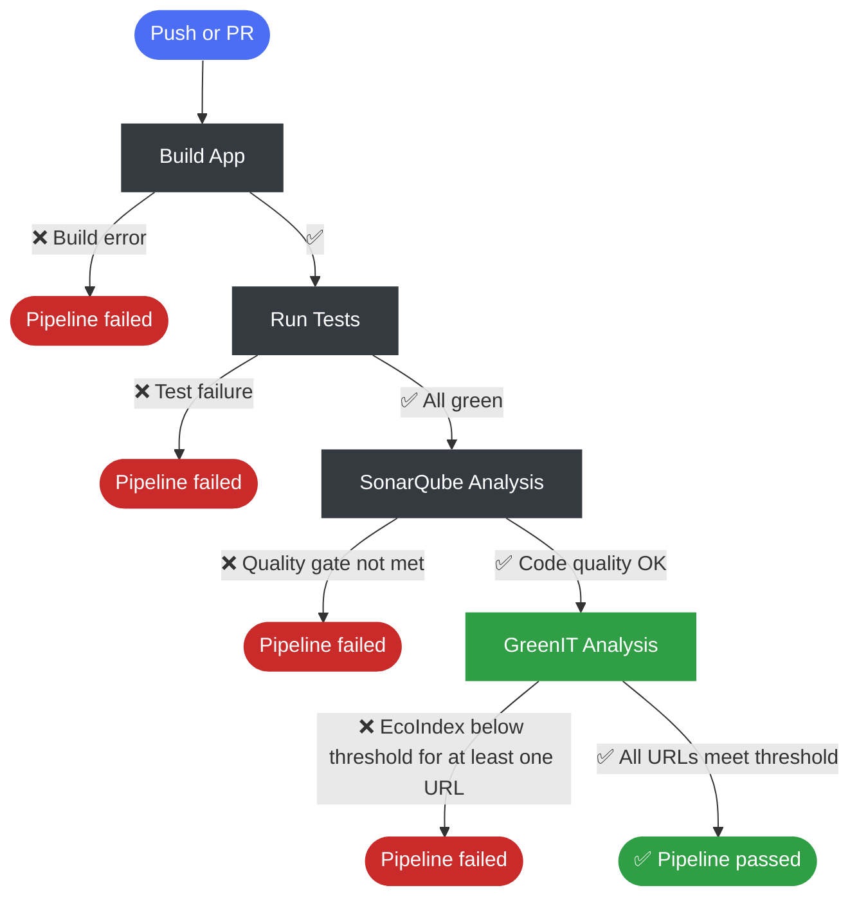

<div align="center">
  <a href="https://github.com/marketplace/actions/greenit-analysis">
    
  </a>
</div>

# GreenIT Analysis

[](https://github.com/ythirion/greenit-analysis-action/releases)
[](LICENSE)

A GitHub Action that runs [GreenIT-Analysis CLI](https://github.com/jpreisner/greenit-analysis-cli) against your web application and enforces an **EcoIndex quality gate** directly in your CI pipeline.

> Built on top of the `jpreisner/greenit-analysis-cli` Docker image.

---

## What it does

1. Runs GreenIT-Analysis CLI through `Docker` against one or more URLs
2. Generates an `HTML report` with EcoIndex scores
3. Enforces a configurable `quality gate` (fails if **any** URL scores below the threshold)
4. Uploads the HTML report as a workflow artifact

## CI Pipeline overview

Here is an example of a pipeline and how to integrate this action:



---

## Prerequisites
- The runner must have `Docker` available (`ubuntu-latest` on GitHub-hosted runners works out of the box)
- Your web application must be **running and reachable** on the runner before calling this action
- The runner needs `--cap-add=SYS_ADMIN` Docker capability (available on GitHub-hosted runners)

---

## Usage

### With a URL file

Create a `greenit-urls.yaml` file in your repository (this is the default file name):

```yaml
# greenit-urls.yaml
- name: 'Home'
  url: 'http://localhost:8080'
- name: 'About'
  url: 'http://localhost:8080/about'
```

Then use the action — no extra configuration needed when the file is at the default path:

```yaml
- name: GreenIT Analysis
  uses: ythirion/greenit-analysis@v1
  with:
    min-ecoindex: '75'
```

Or point to a custom file location:

```yaml
- name: GreenIT Analysis
  uses: ythirion/greenit-analysis@v1
  with:
    url-file: 'tests/greenit-urls.yaml'
    min-ecoindex: '75'
```

### Use outputs in subsequent steps

```yaml
- name: GreenIT Analysis
  id: greenit
  uses: ythirion/greenit-analysis@v1
  with:
    url-file: 'greenit-urls.yaml'

- name: Print EcoIndex
  run: echo "Lowest EcoIndex score is ${{ steps.greenit.outputs.ecoindex }}"
```

---

## Full workflow example

This example shows how to integrate the action after a successful CI run (pattern used in the original project this action was extracted from):

```yaml
name: Green IT

on:
  workflow_run:
    workflows: ["CI"]
    types:
      - completed

jobs:
  greenit:
    if: ${{ github.event.workflow_run.conclusion == 'success' }}
    runs-on: ubuntu-latest

    steps:
      - name: Checkout same commit
        uses: actions/checkout@v4
        with:
          ref: ${{ github.event.workflow_run.head_sha }}

      - name: Setup Node.js
        uses: actions/setup-node@v4
        with:
          node-version: '24'

      - name: Install dependencies
        run: |
          npm install
          npm run install:all

      - name: Build frontend
        run: npm run build:frontend

      - name: Start backend & frontend
        run: |
          npm run start:backend &
          npm run start:frontend &
          npx wait-on http://localhost:8080

      - name: GreenIT Analysis
        uses: ythirion/greenit-analysis@v1
        with:
          url-file: 'greenit-urls.yaml'
          min-ecoindex: '90'
          timezone: 'Europe/Paris'
```

---

## Inputs

| Input               | Description                                               | Required | Default                                 |
|---------------------|-----------------------------------------------------------|----------|-----------------------------------------|
| `url-file`          | Path (relative to workspace) to a YAML file listing URLs  | No       | `greenit-urls.yaml`                     |
| `min-ecoindex`      | Minimum EcoIndex score (0–100) to pass the quality gate   | No       | `50`                                    |
| `timezone`          | Timezone passed to the GreenIT container                  | No       | `Europe/Paris`                          |
| `greenit-image`     | Docker image for GreenIT-Analysis CLI                     | No       | `jpreisner/greenit-analysis-cli:latest` |
| `fail-on-threshold` | Fail the step if any URL EcoIndex is below `min-ecoindex` | No       | `true`                                  |
| `upload-report`     | Upload the HTML report as a workflow artifact             | No       | `true`                                  |
| `report-name`       | Name of the uploaded artifact                             | No       | `greenit-report`                        |
| `retention-days`    | Number of days to retain the uploaded artifact            | No       | `30`                                    |

### URL file format

```yaml
- name: 'Page name shown in report'
  url: 'http://localhost:8080/path'
- name: 'Another page'
  url: 'http://localhost:8080/other'
```

More infos on the url file format and its options [here](https://github.com/cnumr/GreenIT-Analysis-cli?tab=readme-ov-file#construction-du-fichier-dentr%C3%A9e).

> **Quality gate behaviour:** the step fails if **at least one** URL scores below `min-ecoindex`. The `ecoindex` output contains the **lowest** score across all analyzed URLs.

---

## Outputs

| Output        | Description                                                |
|---------------|------------------------------------------------------------|
| `ecoindex`    | The lowest EcoIndex score (0–100) across all analyzed URLs |
| `report-path` | Absolute path to the generated HTML report on the runner   |

---

## Docker image caching

The action automatically caches the GreenIT Docker image between runs using `actions/cache@v4`. The cache key is based on the image name/tag, so:

- **First run**: the image is pulled from Docker Hub and saved to cache
- **Subsequent runs**: the image is loaded from cache, skipping the pull entirely

This significantly speeds up workflow runs after the first execution.

---

## License

MIT – see [LICENSE](LICENSE)
